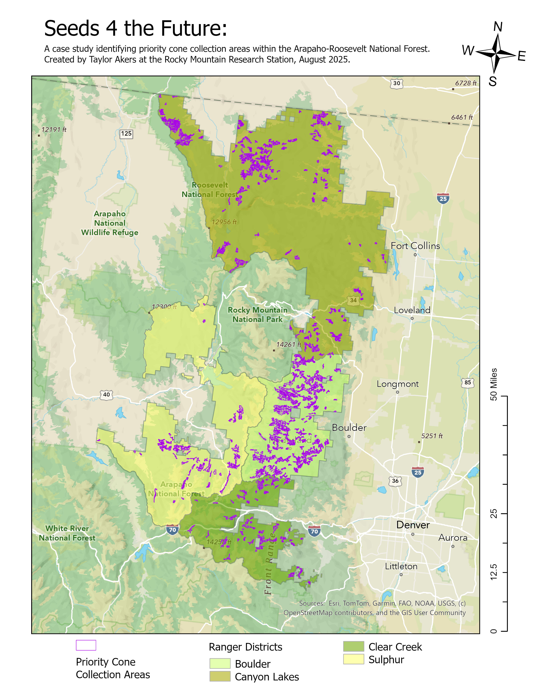

# About Me

## Professional 

### What I do (present)

I am currently working as an [ORISE](https://orise.orau.gov/) Post-Master's Fellow with the USDA Forest Service at the [Rocky Mountain Research Station](https://research.fs.usda.gov/rmrs).
My current research project will create spatial data resouces to help guide forest managers when planning for conifer cone collection as part of the [reforestation pipeline](https://www.frontiersin.org/journals/forests-and-global-change/articles/10.3389/ffgc.2021.629198/full).

Here is a map that I created to showcase pirority areas for conifer cone collection within the Arapaho-Roosevelt National Forest. 

### What I did (past)

I started my career studying molecular biology at UC Santa Cruz and worked as an undergraduate in Dr. Al Zahler's lab on a project with Dr. Matt Ragle studying [gene regulation](https://genome.cshlp.org/content/25/7/982.short).
I enjoyed the research in itself, but after graduating decided that I wanted to learn more about the world in a broader way and figure out my place in it.
I traveled for a couple of years, working odd jobs, and then started [teaching English in Spain](https://conversaspain.com/auxiliares-de-conversacion/) where I lived for 3.5 years.
Pandemic and etc brought me home to California and while taking care of family, I completed a Master's of Science at CSU, Sacramento in Ecology, Evolution and Conservation Biology.
For my thesis research, I studied the impact of fuel management treatments (prescribed fire and mechanical thinning) on soil fungal diversity in a mixed coniferous forest.

Here is a map of my alma matre:
(buttons on top right allow interaction) 

<embed type="text/html" src="img/ucsc_map2.html" width="600" height="600">

### What I want to do (future)

While none of us know what the future holds, I am keeping my options open and trying to remain flexible and hopeful for a more inclusive and supportive world.
That being said, I will go where there is opportunity for me to continue with open science.
That may be pursuing a PhD, or it may be working in land management, or it may be both with a roundabout path between.
No matter what chapter is next, I hope to continue developing new skills while making a positive impact on the world. 

For example, this year I took a Data Short Course taught by Environmental Data Science Innovation and Impact Lab ([ESIIL](https://esiil.org/)) and learned how to create this GitHub portfolio page and embedded interactive maps!

Here are two graphs depicting climate trends in Fort Collins, Colorado (my current home). Data was pulled from [NOAA NCEI](https://www.ncei.noaa.gov/access), specifically using [this weather station](https://www.ncdc.noaa.gov/cdo-web/datasets/GHCND/stations/GHCND:USC00053005/detail) with records going back to the late 1800s. As you pan around in the mean max temp graph, you can see that the mean max temp in Fort Collins has risen over 2 degrees Fahrenheit over the last century. 
<embed type="text/html" src="img/FC_ann_TMAX_plot_hv.html" width="600" height="300">
<embed type="text/html" src="img/FC_ann_PCRP_plot_hv.html" width="600" height="300">

## Personal

### Fun facts / interests 

I am interested in all sorts of hobbies (writing, reading, crafting, mushroom hunting, aquarium keeping, vermicomposting) and activities (hiking, biking, gardening).
What I am focusing on at this stage in life is to finish projects that I have started and be content with routine (which means saying no sometimes and striving for balance between what is new and old).

### Contact

Connect with me on [LinkedIn](https://www.linkedin.com/in/taylor-akers-24293667 "Taylor Akers")!

