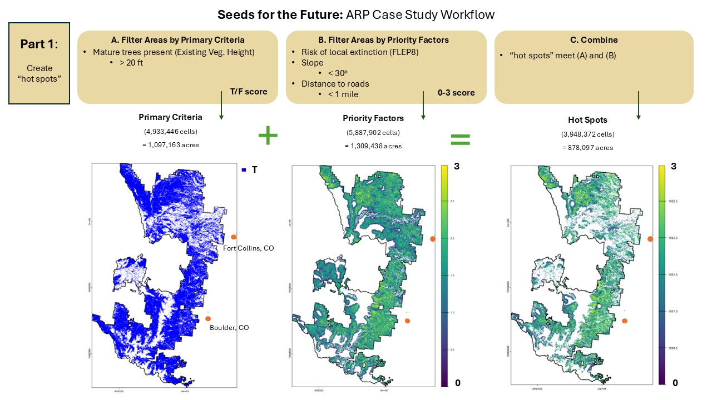
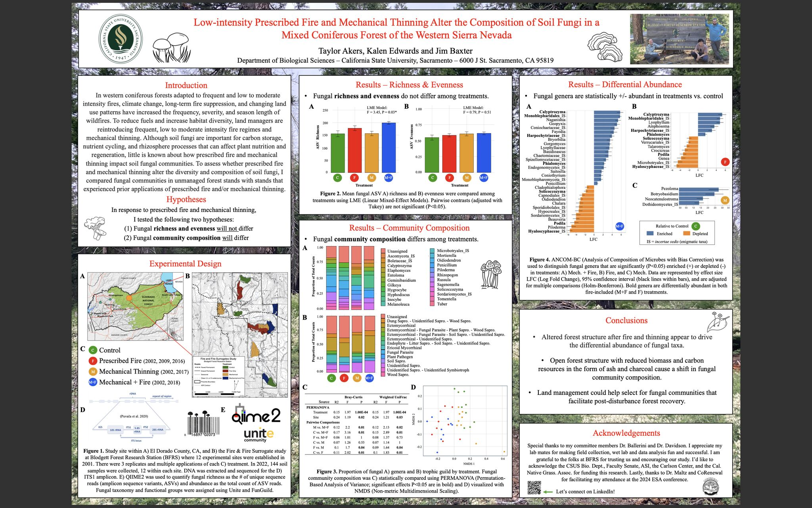

# About Me

## Professional 

### What I do (present)

I am currently working as an [ORISE](https://orise.orau.gov/) Post-Master's Fellow with the USDA Forest Service at the [Rocky Mountain Research Station](https://research.fs.usda.gov/rmrs).
My current research project will create spatial data resouces to help guide forest managers when planning for conifer cone collection as part of the [reforestation pipeline](https://www.frontiersin.org/journals/forests-and-global-change/articles/10.3389/ffgc.2021.629198/full).

Here is a map that I created using ArcGIS Pro to showcase pirority areas for conifer cone collection within the Arapaho-Roosevelt National Forest. 

The image below has 3 maps that I created using R Studio, depicting intermediate steps and methodology used in creating the final map above. They are embedded in a slideshow and were part of a presentation that I gave to land managers. 

While at RMRS, I am gaining many new skills and am particularly focused on spatial data analysis. For example, I just finished a short course taught by Environmental Data Science Innovation and Impact Lab ([ESIIL](https://esiil.org/)) and learned how to create this GitHub portfolio page and embedded interactive maps & graphs!

Here is graph that I made using Python programming language in GitHub's Codespaces. It depicts temperature trends over the last century in Fort Collins, Colorado (my current home). During the course, I learned how to pull climate data from [NOAA NCEI](https://www.ncei.noaa.gov/access), specifically using [this weather station](https://www.ncdc.noaa.gov/cdo-web/datasets/GHCND/stations/GHCND:USC00053005/detail). You can see that the mean max temp in Fort Collins has risen over 2 degrees Fahrenheit over the last century! 
<embed type="text/html" src="img/FC_ann_TMAX_plot_hv.html" width="600" height="300">

### What I did (past)

I started my career studying molecular biology at UC Santa Cruz and worked as an undergraduate in Dr. Al Zahler's lab on a project with Dr. Matt Ragle studying [gene regulation](https://genome.cshlp.org/content/25/7/982.short).
I enjoyed the research in itself, but after graduating decided that I wanted to learn more about the world in a broader way and figure out my place in it.
I traveled for a couple of years, working odd jobs, and then started [teaching English in Spain](https://conversaspain.com/auxiliares-de-conversacion/) where I lived for 3.5 years.
Pandemic and etc brought me home to California and while taking care of family, I completed a Master's of Science at CSU, Sacramento in Ecology, Evolution and Conservation Biology.
For my thesis research, I studied the impact of fuel management treatments (prescribed fire and mechanical thinning) on soil fungal diversity in a mixed coniferous forest.

Here's a photo of the poster that I presented at the Ecological Scociety of America 2024 conference:

And just for fun, here is an interactive map of my alma matre, UC Santa Cruz, created with the [HoloViews Python library](https://holoviews.org/):
(buttons on top right allow zooming!) 

<embed type="text/html" src="img/ucsc_map2.html" width="700" height="600">

### What I want to do (future)

While none of us know what the future holds, I am keeping my options open and trying to remain flexible and hopeful for a more inclusive and supportive world.
That being said, I will go where there is opportunity for me to continue working in ecology, conservation, and habitat restoration.
I am interested in pursuing a PhD, but could also see working directly in land management, or I may do both with a roundabout path between.
No matter what chapter is next, I hope to continue developing new skills while making a positive impact on the world. 

## Personal

### Fun facts / interests 

I am interested in all sorts of hobbies (writing, reading, mushroom hunting, aquarium keeping, vermicomposting) and activities (hiking, biking, gardening).
What I am focusing on at this stage in life is to finish projects that I have started and not overstretch my energy. 

### Contact

Connect with me on [LinkedIn](https://www.linkedin.com/in/taylor-akers-24293667 "Taylor Akers")!

